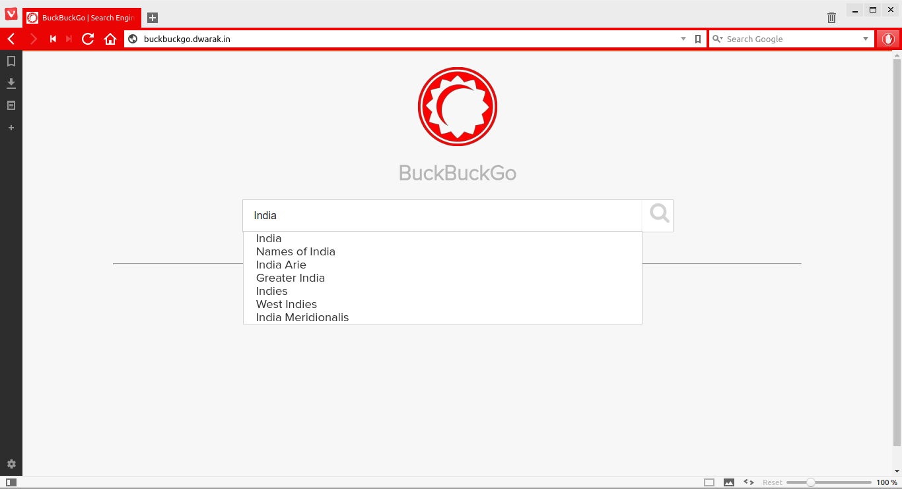
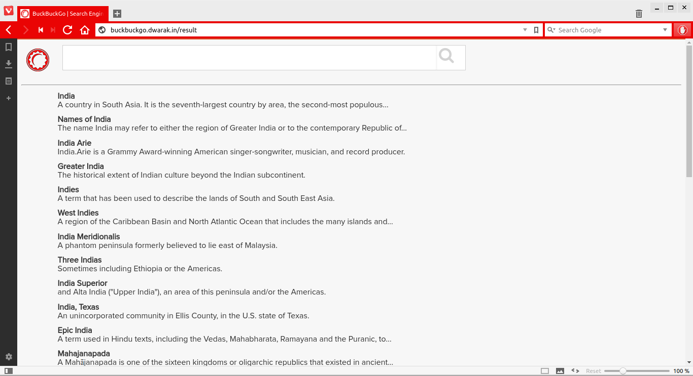
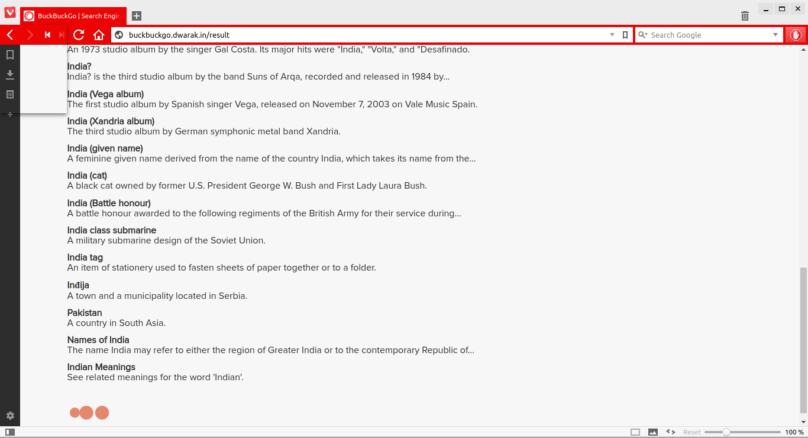
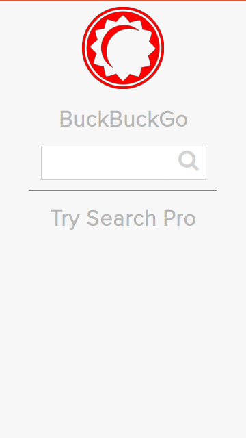
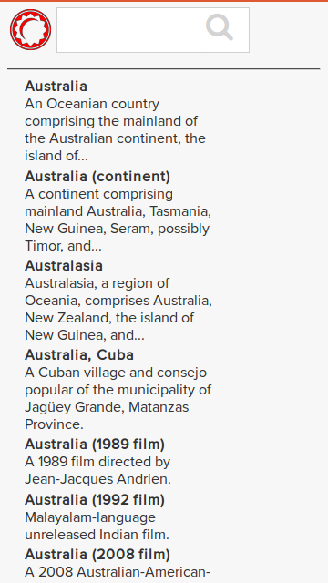

# Buckbuckgo

## What?
[DuckDuckGo Instant Answers API](https://duckduckgo.com/api) made more robust, powerful and awesome!

## Technology
* Rails 4
* NGINX
* DuckDuckGo Instant Answers API

## Dependencies
* ```ruby 2.2```
* ```nginx```

## Features
* Autocomplete. (yay!)
* Spelling Corrector.
* Infinite scroll
* Responsive

## Demo!
[Go Nuts](http://buckbuckgo.dwarak.in/)

## Screenshots
**Home** <br/>

<br/>
**Search Result** <br/>

<br/>
**Infinite Scroll** <br/>

<br/>
**Mobile Home** <br/>

<br/>
**Mobile Result** <br/>

<br/>

## Deployment

To deploy the application, make sure the parameters are properly set at

* [deploy.rb](config/deploy.rb)
* [nginx.conf](config/nginx.conf)
* [database.yml](config/database.yml)

Rest all has been taken care of with ```capistrano``` script.

```
$ sudo apt-get install curl git-core nginx -y
$ git clone https://github.com/dtsdwarak/buckbuckgo.git && cd buckbuckgo
$ bundle install
$ cap production deploy
```

After you deploy, you also need to populate values in the database for Spelling Corrector feature to work. Either migrate ```buckbuckgo.sql``` into the your database or run ```buckbuckgo-spell-corrector.rb```. Scripts available [here](spelling-corrector-deploy/)

## Thanks

* [Peter Norvig](http://norvig.com/spell-correct.html)

## License

[MIT](http://choosealicense.com/licenses/mit/)
